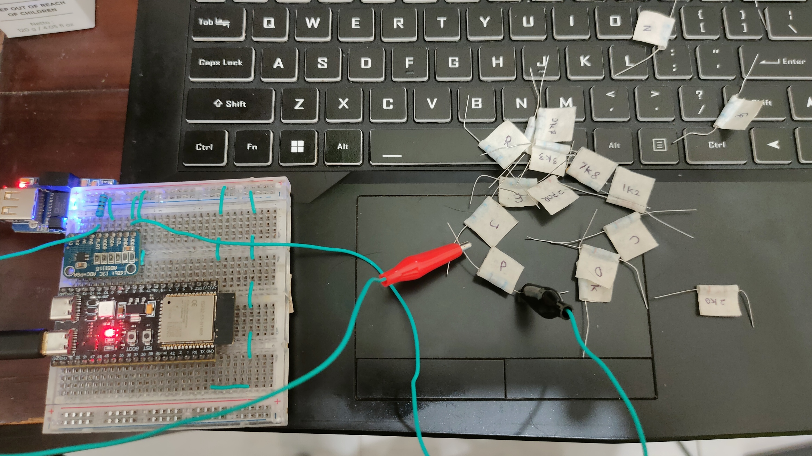
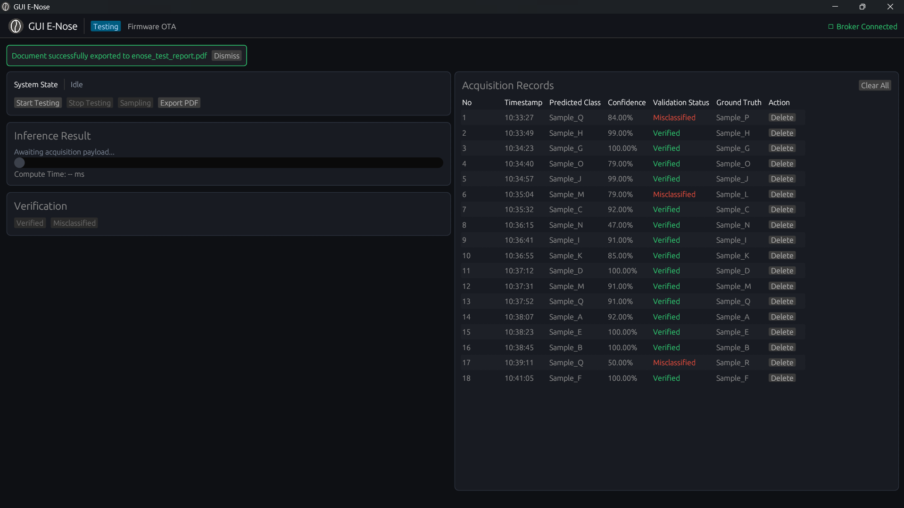
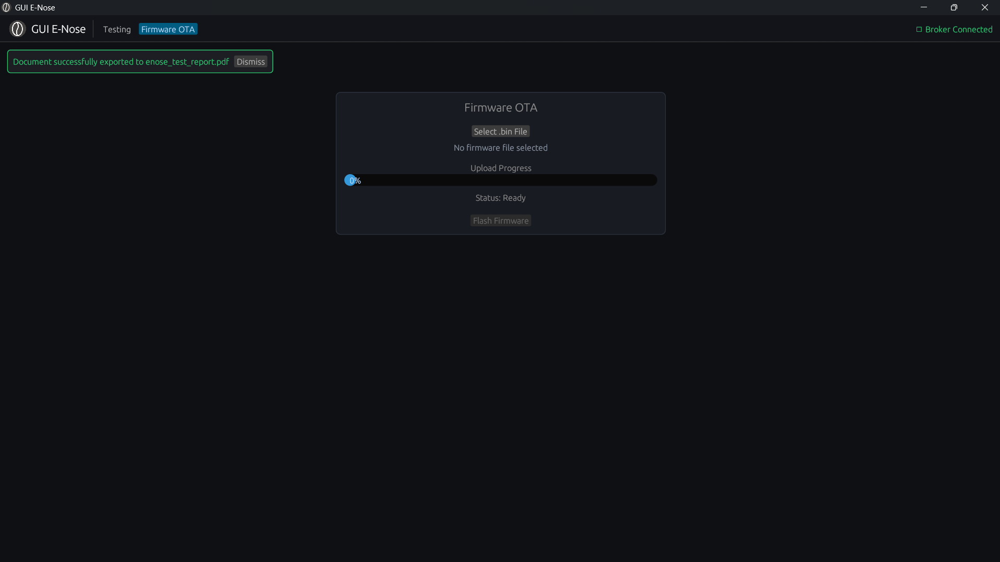
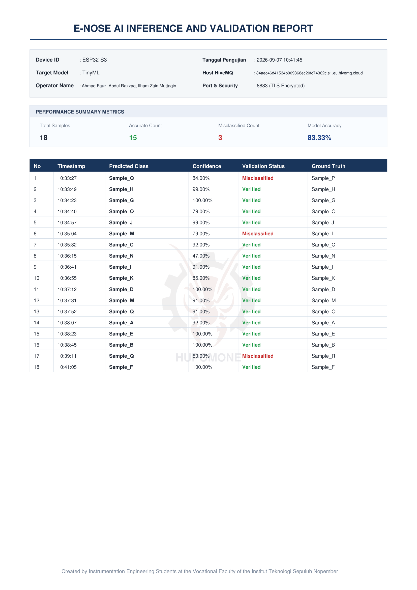

# End-to-End E-Nose Coffee Classification System

[](https://www.rust-lang.org/)
[](https://www.espressif.com/)
[](https://www.edgeimpulse.com/)
[](https://www.hivemq.com/)
[](LICENSE)

An intelligent, production-ready Electronic Nose (E-Nose) system designed for real-time coffee aroma profiling and classification. The platform integrates an ESP32-S3 edge device executing embedded TinyML neural networks, a high-performance cross-platform desktop GUI engineered in Rust (`eframe`/`egui`), encrypted MQTTS telemetry via HiveMQ Cloud (Port 8883), bidirectional Firmware Over-The-Air (OTA) flashing, and closed-loop Active Learning integrated directly with the Edge Impulse Ingestion API.

---

## Project Contributors & Mentorship

This cross-disciplinary engineering project was developed as a structured collaboration between Hardware and Software engineering cohorts.

### Project Advisor
* **Ahmad Radhy, S.Si., M.Si.** — *NIDN: 0013118906*

### Engineering Teams
| Role | Member | Student ID (NRP) | Class Cohort | Responsibility Scope |
| :--- | :--- | :--- | :---: | :--- |
| **Hardware Division** | Ahmadin Fatkhurahman | 2042241015 | Class A | Embedded systems programmer, Device assembler |
| **Hardware Division** | Revi Azizu Rohman | 2042241029 | Class A | Sensor classification data collector, TinyML model trainer |
| **Software Division** | Ilham Zain Muttaqin | 2042241003 | Class C | Cloud broker setup, Edge Impulse pipeline, OTA handler |
| **Software Division** | Ahmad Fauzi Abdul Razzaq | 2042241017 | Class C | Rust desktop GUI development, FSM logic, PDF engine |

---

## System Architecture

The end-to-end operational pipeline synchronizes physical signal acquisition with cloud orchestration, desktop verification, and automated retraining pipelines.

<p align="center">
  
</p>

### Key Architectural Layers:
1. **Sensing Subsystem**: 
   * **Metal Oxide Semiconductor (MOS) Sensor Array**: MQ-3, MQ-6, MQ-7, MQ-135, TGS2600, TGS2602, TGS2611, and TGS2620.
   * **Environmental Compensation**: Dedicated DHT22 sensor providing temperature and relative humidity telemetry.
   * **Precision Digitization**: Dual 16-bit ADS1115 external ADCs configured at I2C addresses `0x48` and `0x49` with programmable gain amplifiers (PGA).
2. **Edge Computing Unit (ESP32-S3)**:
   * Dual-core Xtensa LX7 processor running quantized TinyML inference engines generated via Edge Impulse.
   * Subscribes to runtime sampling triggers and streams inference results with raw feature arrays.
3. **Cloud Telemetry (HiveMQ Cloud)**:
   * Fully encrypted MQTTS broker (TLS v1.2/v1.3 on port 8883) handling command dispatches, classification payloads, and chunked OTA payloads.
4. **Desktop GUI (Rust)**:
   * Engineered natively using Rust and `eframe`/`egui`.
   * Governed by a deterministic Finite State Machine (FSM) ensuring strict operational transitions (`Idle`, `Testing`, `Sampling`, `Verification`).
5. **Continuous Learning (Edge Impulse Ingestion API)**:
   * Real-time dispatch of false-positive / misclassified inference records directly to the cloud training repository for continuous model improvement.
6. **Automated Audit & Reporting**:
   * Programmatic, native PDF document generation using `printpdf`.

---

## Hardware Prototype

The physical prototype integrates the sensor array with dedicated power distribution, I2C pull-ups, and modular voltage divider testbeds used for sensor simulation, model verification, and hardware debugging.

<p align="center">
  
</p>

---

## Desktop Operator Interface (Rust GUI)

The desktop application provides an industrial dark-themed control center built with multi-threaded, asynchronous message passing channels (`mpsc`).

### 1. Real-Time Inference & Verification
Handles sampling triggers with an automated 10-second watchdog protection, confidence score visualization with dynamic color interpolation, and one-click validation. Operators can approve predictions as **Verified** or flag them as **Misclassified**, opening ground-truth selection and triggering Edge Impulse cloud synchronization.

<p align="center">
  
</p>

### 2. Wireless Firmware OTA Management
Enables seamless field upgrades over MQTT without physical USB access. Binary firmware files (`.bin`) are segmented into 1024-byte chunks, dispatched sequentially, and verified via bidirectional ACK signals with automated retry and timeout fail-safes.

<p align="center">
  
</p>

---

## Automated PDF Inspection Reports

The platform features an embedded PDF report generator built on `printpdf`. At the conclusion of any test run, operators can export tamper-evident inspection documents featuring executive performance summaries, acquisition timestamp logs, classification accuracy metrics, and security watermarks.

<p align="center">
  
</p>

---

## Repository Structure

```text
e-nose-coffee-classification/
├── Assets/
│   ├── Architectural_Preview.png
│   ├── Device_Preview.png
│   ├── GUI_Preview_on_the_OTA_Page.png
│   ├── GUI_Preview_on_the_Testing_Page.png
│   └── Report_Preview.png
├── Class_A/                       
├── Class_C/                       
├── Class_A_Report_Document.pdf    
├── Class_C_Report_Document.pdf    
├── LICENSE                        
└── README.md                      
```

---

## Departmental Affiliation

<p align="center">
  <strong>Study Program of D4 Instrumentation Technology</strong><br>
  Department of Instrumentation Engineering<br>
  Faculty of Vocational<br>
  <strong>Institut Teknologi Sepuluh Nopember (ITS)</strong><br>
  Surabaya, Indonesia
</p>
